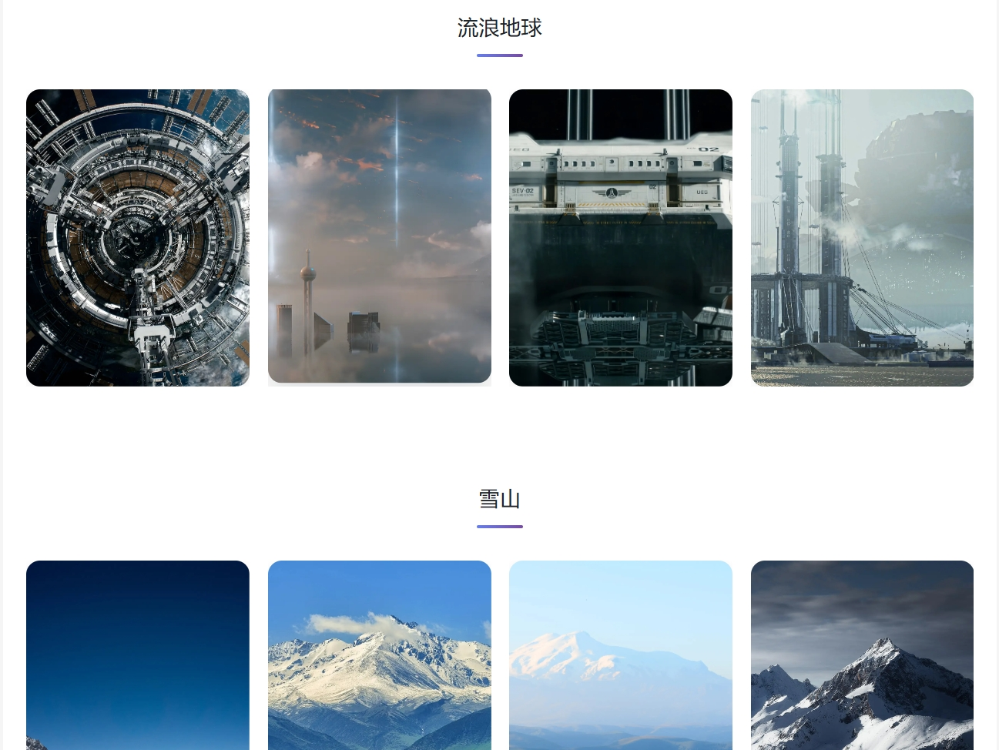

# 照片墙插件 (WP Photo Wall)

一个极简风格的照片墙 WordPress 插件，带有强大的后台管理和极致的前端性能优化。

## 页面预览


## ✨ 特性

- **极简设计**: 采用极简风格的 UI 设计，清爽、现代。
- **强大的后台管理**:
    - 支持从 WordPress 媒体库添加本地图片。
    - 支持添加外部链接图片（兼容 CDN 带参数的 URL）。
    - **分组管理**：创建多个分组，通过拖拽或批量选择移动图片到目标分组。
    - **分组排序**：拖动分组标题左侧抓手图标，即可调整分组在前台的展示顺序。
    - **批量操作**：支持批量移动分组、批量从照片墙移除、从媒体库永久删除。
- **极致性能优化**:
    - **后台**: 缩略图由 PHP 端一次性预加载，消除 N+1 AJAX 请求；批量 DOM 更新。
    - **前台**:
        - **异步解码 (`decoding="async"`)**：防止大图解码阻塞主线程。
        - **智能可见性 (`content-visibility`)**：只渲染视口内的图片，极大降低内存占用。
        - **懒加载 (`loading="lazy"`)**：提升首屏加载速度。
        - **滚动节流**：滚动时自动禁用 hover 动画，提升移动端流畅度。
        - **淡入动画**：图片加载时带有错落的淡入效果，视觉体验流畅优雅。
- **响应式布局**: 自动适应桌面、平板和手机。
- **内置灯箱 (Lightbox)**: 自带轻量级灯箱效果，支持键盘左右切换、焦点陷阱。

## 📁 项目结构

```
photo-wall/
├── wp-photo-wall.php          # 主入口文件（精简加载器）
├── includes/
│   ├── i18n.php               # 多语言翻译定义
│   ├── data.php               # 数据操作与校验
│   ├── ajax.php               # AJAX 请求处理
│   └── frontend.php           # 前端渲染与短代码
├── admin/
│   ├── admin-page.php         # 后台页面模板
│   ├── admin-script.js        # 后台交互逻辑
│   └── admin-style.css        # 后台样式
├── public/
│   ├── shortcode.php          # 短代码输出模板
│   ├── gallery-script.js      # 前台交互（灯箱、无限滚动）
│   └── gallery-style.css      # 前台样式
├── uninstall.php              # 卸载清理
└── README.md
```

## 📥 安装

1. 下载插件压缩包（`photo-wall-2.0.0.zip`）。
2. 在 WordPress 后台 → **插件** → **安装插件**。
3. 点击 **上传插件**，选择 zip 文件并安装。
4. 启用插件。

## 🚀 使用方法

### 1. 添加图片

在 WordPress 后台侧边栏找到 **"照片墙"** 菜单。

- 点击 **"选择/上传照片"** 从媒体库选择。
- 点击 **"添加外部链接"** 输入图片 URL。
- 新添加的图片默认放入"未分组"。

### 2. 分组管理

- 在照片管理区域顶部输入名称，点击 **"添加分组"** 创建新分组。
- **拖拽图片**：直接拖动图片到目标分组。
- **批量移动**：勾选图片 → 点击"移动选中"按钮 → 在弹窗中选择目标分组 → 确认。
- **调整分组顺序**：拖动分组标题左侧的 ≡ 图标。
- 所有操作需要点击 **"保存更改"** 才会生效。

### 3. 在页面显示

在任意页面或文章中使用短代码：

```
[photo_wall]
```

> 图片必须移动到一个已创建的分组后才会显示在前台；"未分组"是后台暂存区，不会公开显示。

同一页面可以放置多个 `[photo_wall]`，每个实例的分页和灯箱状态彼此独立。

### 4. 前端功能

- 悬停图片会有轻微上浮效果。
- 点击图片进入全屏灯箱模式。
- 滚动到底部会自动加载更多（无限滚动）。
- 灯箱支持键盘导航（←→切换，Esc 关闭）、焦点循环和关闭后焦点恢复。

### 5. 设置选项

- **启用灯箱**：可关闭内置灯箱（适用于主题已有灯箱的情况）。
- **下载按钮链接**：配置外部网盘下载地址，前台显示下载入口。

## 📋 系统要求

- WordPress 6.0+
- PHP 7.4+

## 🔄 更新日志

### 2.0.3
- **前端优化**：图片加载淡入动画，错落延迟效果，视觉更柔和
- **前端优化**：分组标题重构，渐变色装饰线 + 加大分组间距，更有质感和呼吸感
- **修复**：未保存提醒在页面初始加载时误触发的问题
- **改进**：未保存提醒移至页面顶部醒目位置，使用自定义通知条样式
- **架构重构**：主文件拆分为模块化结构（i18n / data / ajax / frontend），可维护性大幅提升
- **性能优化**：后台缩略图由 PHP 端一次性预加载，消除 N+1 AJAX 请求

## 📜 许可证

GPL v2 or later
